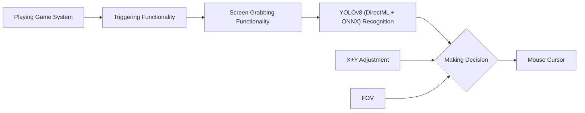

> [!NOTE]
> If you enjoy Bahemot, please consider giving us a star ⭐! We appreciate it! :)
> 
 

  

 
###
Bahemut, developed by TigaoBrabo and the BZWARE team, is an AI-based aim alignment mechanism designed to make gaming more accessible for players who struggle with aiming.

⚡ Key Features

Powered by DirectML, ONNX, and YOLOV8 for maximum accuracy and speed.

Optimized performance on AMD GPUs, outperforming solutions that rely on TensorRT.

Simple interface, advanced features, and customization options without the need for coding.

💡 Philosophy

100% free: no ads, no paywalls, no key system.

To access Bahemut, you must log into the official BZWARE Discord server.

But not open source.

🌐 Connect with Us

Discord (mandatory for free access): https://discord.gg/VHAsgUy4hd

Official Website: https://bzware.online/

## Table of Contents
- [What is the purpose of Bahemot?](#what-is-the-purpose-of-Bahemot)
- [How does Bahemot Work?](#how-does-Bahemot-work)
- [Features](#features)
- [Setup](#setup)
- [How is Bahemot better than similar AI-Based tools?](#how-is-Bahemot-better-than-similar-ai-based-tools)
- [How the hell is Bahemot free?](#how-the-hell-is-Bahemot-free)
- [How do I train my own model?](#how-do-i-train-my-own-model)
- [How do I upload my model to the "Downloadable Models" menu](ModelUpload.md)

## What is the purpose of Bahemot?
### Bahemot was designed for Gamers who are at a severe disadvantage over normal gamers.
### This includes but is not limited to:
- Gamers who are physically challenged
- Gamers who are mentally challenged
- Gamers who suffer from untreated/untreatable visual impairments
- Gamers who do not have access to a seperate Human-Interface Device (HID) for controlling the pointer
- Gamers trying to improve their reaction time
- Gamers with poor Hand/Eye coordination
- Gamers who perform poorly in FPS games
- Gamers who play for long periods in hot environments, causing greasy hands that make aiming difficult 

## How does Bahemot Work?

When you press the trigger binding, Aimmy will capture the screen and run the image through AI recognition powered by your computer hardware. The result it develops will be combined with any adjustment you made in the X and Y axis, and your current FOV and will result in a change in your mouse cursor position.

## Features
1. Full Fledged UI
	- Bahemot provides a well designed and full-fledged UI for easy usage and game adjustment.
2. DirectML + ONNX + YOLOv8 AI Detection Algorithm
	- The use of these technologies allows Bahemot to be one of the most accurate and fastest Aim Alignment Mechanisms out there in the world
3. Dynamic Customizability System
	- Bahemot provides an interactive customizability system with various features that auto-updates the way Bahemot will aim as you customize. From AI Confidence to FOV, Bahemot makes it easy for anyone to tune their aim
4. Dynamic Visual System
	- Bahemot contains a universal ESP system that will highlight the player detected by the AI. This is helpful for visually impaired users who have a hard time differentiating enemies, and for configuration creators attempting to debug their configurations.
5. Mouse Movement Method
	- Bahemot grants you the right to switch between 5 Mouse Movement Methods depending on your Mouse Type and Game for better Aim Alignment
6. Hotswappability
	- Bahemot lets you hotswap models and configurations on the go. There is no need to reset Bahemot to make your changes
7. Model and Configuration Store with Repository Support
	- Bahemot makes it easy to get any models and configurations you may ever need, and with repository support, you can get up to date with the latest models and configurations from your favorite creators

## Setup
- Download and Install the x64 version of [.NET Runtime 8.0.X.X]( )
- Download and Install the x64 version of [Visual C++ Redistributable]( )
- Download Aimmy from [Releases]( ) (Make sure it's the Bahemot zip and not Source zip)
- Extract the Bahemot.zip file
- Run Bahemot.exe
- Choose your Model and Enjoy :)

## How is Bahemot better than similar AI-Based tools?
Bahemot is written in C# using .NET 8 and WPF utilizing pre-existing libraries like DirectML and ONNX. This has allowed us to make a very fast Aim Aligner with high compatiblity on both AMD and NVIDIA GPUs without sacrificing the end-user experience.
###

 

  

###

Beyond the core functionality, Bahemot also adds some amazing additional features like Detection ESP to help you tune your gaming experience however you like it.

Bahemot comes pre-bundled with a well trained AI model with thousands of images. 

Besides that model, Bahemot provides dozens of other community made models through the store and our Discord server, with more models being developed every day by other Bahemot users. These models vary from game to image count, making Bahemot incredibly versatile and universal for thousands of games on the market right now.

## How the hell is Bahemot free?
As an AI based Aim Aligner, Bahemot does not require any sort of upkeep because it does not read any specific game data to perform it's actions. If Bahemot team stops maintaining Bahemot, even if no one pitches in to fork and maintain the project, Bahemot would still work.

This has meant that while we do currently use out of pocket expenses to run Bahemot, those expenses have been low enough that it hasn't been a necessity for Bahemot to run on even an ad-supported model.

We do not seek to make money from Bahemot, we only seek your kind words <3, and a chance to help people aim better, by assisting their aim or even to train how they aim (yes, you can use Bahemot in that way too)

## How do I train my own model
Please see the video tutorial below on how to label images and train your own model. (Redirects to Streamable)

## How do I upload my model to the "Downloadable Models" menu?
Please read the tutorial at [UploadModel.md](ModelUpload.md)
